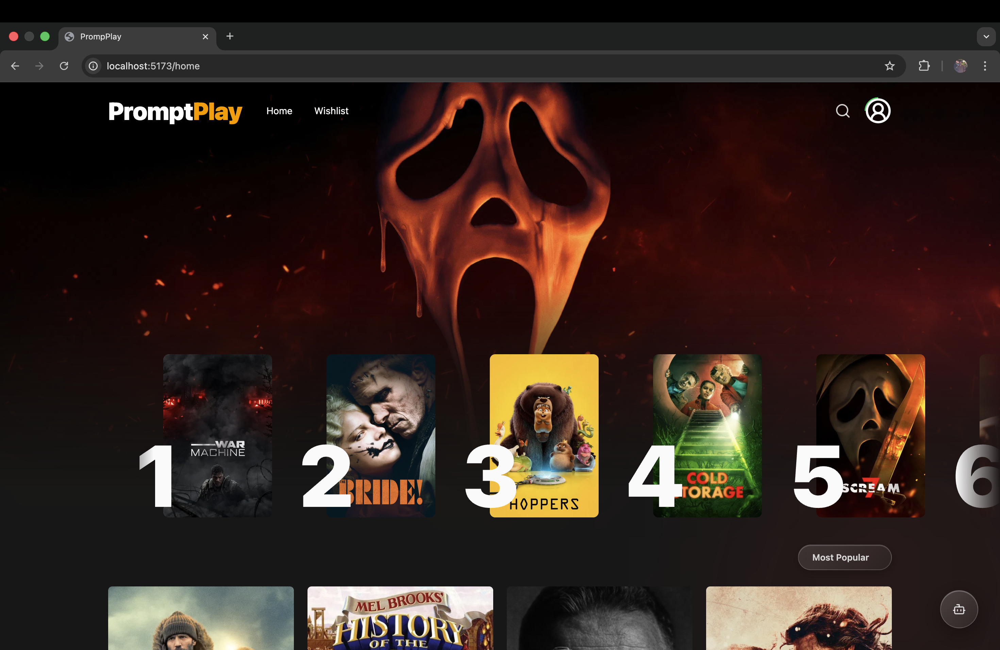
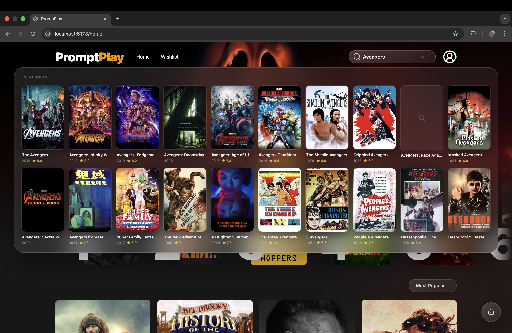
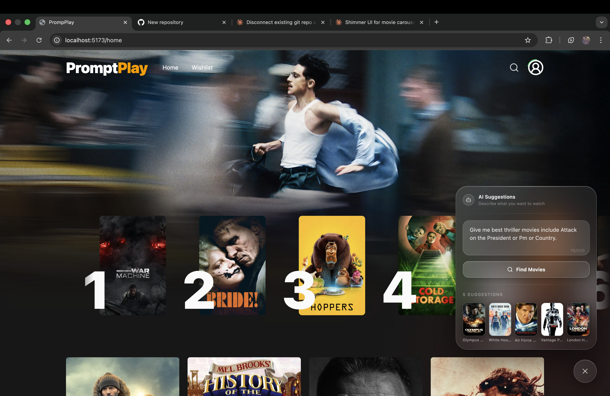
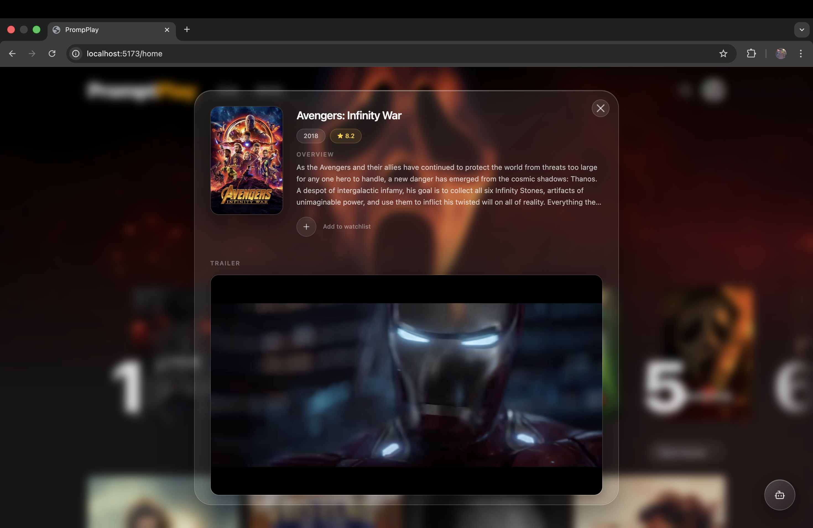
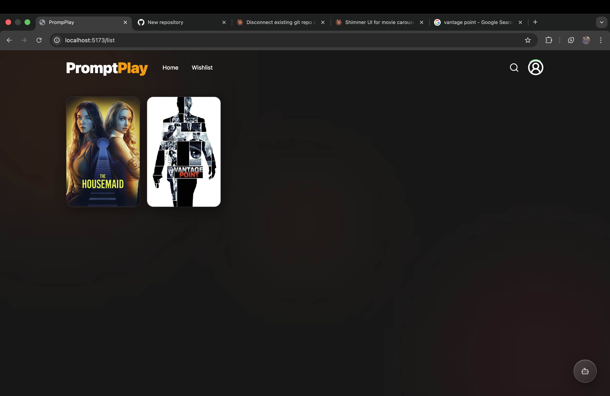

# 🎬 PromptPlay

> AI-powered movie discovery — describe a mood, get your next obsession.

PromptPlay is a full-stack movie discovery platform that lets you find exactly what to watch using natural language. Instead of endlessly scrolling, just describe a feeling, a genre, or a vibe — and let Gemini AI find your next watch.


---

## ✨ Features

- 🤖 **AI Movie Search** — Describe what you want to watch in natural language and get personalized recommendations powered by Gemini AI
- 🎥 **Movie Browser** — Browse trending, top-rated, and latest movies with real-time data from TMDB
- 🔍 **Smart Search** — Debounced live search with full-width results panel
- 🎬 **In-App Trailers** — Watch YouTube trailers inside a glass modal without leaving the page
- 📌 **Watchlist** — Save and manage movies in your personal watchlist
- 🔐 **Authentication** — Google OAuth and email/password sign in with JWT cookies
- 💳 **Subscriptions** — Free and premium plans with Stripe integration
- 📱 **Fully Responsive** — Mobile-first design optimized for all screen sizes
- 🍎 **Apple Glass UI** — Custom glassmorphism design system consistent across all components

---

## 🛠 Tech Stack

### Frontend

| Technology                | Purpose                          |
| ------------------------- | -------------------------------- |
| React 19                  | UI framework                     |
| Redux Toolkit + RTK Query | State management + data fetching |
| Framer Motion             | Animations                       |
| Tailwind CSS              | Styling                          |
| React Hook Form           | Form validation                  |
| React Router v6           | Client-side routing              |

### Backend

| Technology         | Purpose            |
| ------------------ | ------------------ |
| Node.js + Express  | Server             |
| MongoDB + Mongoose | Database           |
| JWT + Cookies      | Authentication     |
| bcrypt             | Password hashing   |
| Stripe             | Payment processing |

### External APIs

| API              | Purpose                                |
| ---------------- | -------------------------------------- |
| TMDB API         | Movie data, posters, trailers          |
| Google Gemini AI | Natural language movie recommendations |
| Google OAuth     | Social authentication                  |

---

## 📁 Project Structure

```
PromptPlay/
├── frontend/
│   ├── src/
│   │   ├── component/       # Reusable UI components
│   │   ├── screens/         # Page components
│   │   ├── Utils/
│   │   │   ├── Slices/      # Redux slices + RTK Query
│   │   │   ├── Constants.js
│   │   │   ├── appStore.js
│   │   │   └── ProtectedRoutes.jsx
│   │   └── App.jsx
│   ├── .env
│   └── package.json
│
├── backend/
│   ├── Models/              # Mongoose models
│   ├── Routes/              # Express routers
│   ├── Middlewares/         # Auth middleware
│   ├── Services/            # Shared service functions
│   ├── .env
│   ├── app.js
│   └── package.json
│
└── README.md
```

---

## 🚀 Getting Started

### Prerequisites

- Node.js >= 18
- MongoDB (local or Atlas)
- TMDB API key
- Google Gemini API key
- Google OAuth client ID
- Stripe account

---

### 1. Clone the repository

```bash
git clone https://github.com/Angad0045/PromptPlay.git
cd PromptPlay
```

---

### 2. Backend setup

```bash
cd backend
npm install
```

Create a `.env` file in the `backend/` folder:

```env
NODE_ENV=development
PORT=5000

# Database
MONGO_URI=your_mongodb_connection_string

# Auth
JWT_SECRET=your_jwt_secret
JWT_TIMEOUT=12h

#OAuth 2.0
GOOGLE_CLIENT_ID=OAuth_client_ID
GOOGLE_CLIENT_SECRET=OAuth_secret

# TMDB
TMDB_SECRET_KEY=your_tmdb_bearer_token

# Gemini AI
GEMINI_API_KEY=your_gemini_api_key

# Stripe
STRIPE_SECRET_KEY=your_stripe_secret_key
STRIPE_WEBHOOK_SECRET=your_stripe_webhook_secret

# Client URL (for CORS)
CLIENT_URL=http://localhost:5173
```

Start the backend:

```bash
npm run dev
```

---

### 3. Frontend setup

```bash
cd frontend
npm install
```

Create a `.env` file in the `frontend/` folder:

```env
VITE_GOOGLE_CLIENT_CODE=your_google_oauth_client_id
```

Start the frontend:

```bash
npm run dev
```

---

### 4. Open the app

```
http://localhost:5173
```

---

## 🔐 Authentication Flow

```
Email/Password  ──┐
                  ├──▶ JWT token set as httpOnly cookie ──▶ Protected routes
Google OAuth    ──┘
```

- Cookies are `httpOnly`, `sameSite: lax`, `secure` in production
- `userAuth` middleware validates JWT on every protected request
- ProtectedRoutes component handles frontend auth guard

---

## 💳 Subscription Plans

| Feature            | Free | Premium |
| ------------------ | ---- | ------- |
| Browse movies      | ✅   | ✅      |
| Search movies      | ✅   | ✅      |
| Watchlist          | ✅   | ✅      |
| AI suggestions     | ❌   | ✅      |
| Unlimited trailers | ❌   | ✅      |

Payments are handled by **Stripe Checkout** for subscriptions

---

## 🌐 API Endpoints

### Auth

```
POST   /auth/signUpWithEmailPassword
POST   /auth/signInWithEmailPassword
POST   /auth/signInWithGoogle
GET    /auth/user
POST   /auth/logout
```

### Movies

```
POST   /movies/all
GET    /movies/search?query=&page=
GET    /movies/trending
GET    /movies/trailer/:id
POST   /movies/promptPlay
```

### Watchlist

```
GET    /watchlist
POST   /watchlist
DELETE /watchlist/:id
```

### Payments

```
GET   /payment/subcribe
GET   /payment/success
GET   /payment/cancel
GET    /payment/manage/subscription/:customerId
```

---

## 🔒 Security Highlights

- Passwords hashed with `bcrypt`
- JWT stored in `httpOnly` cookies — not accessible via JavaScript
- Generic error messages to prevent user enumeration
- Input validation on all auth routes
- Prompt injection prevention on AI endpoint
- `console.error` guarded behind `NODE_ENV` check in production
- CORS restricted to frontend origin only

---

## 📸 Screenshots

### Home



### Search



### AI Search



### Movie Details



### Watchlist



---

## 🙌 Author

**Angad Patil**

- GitHub: [@Angad0045](https://github.com/Angad0045)

---

## 📄 License

This project is licensed under the MIT License.
